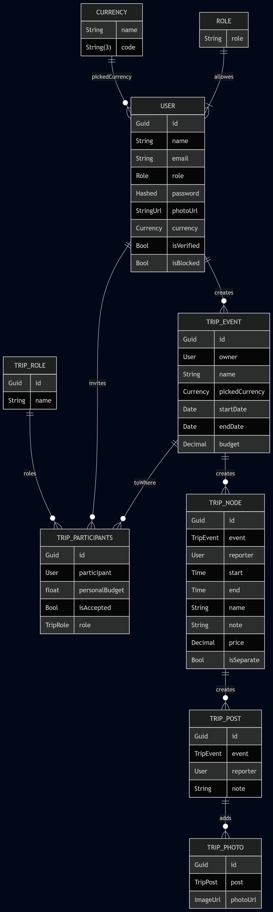

# ✈️ Trippy – Group Travel & Expense Manager

## Zespół
```
- Oleksii Nawrocki - PM
- Julia Chmura
- Tomasz Nowak
- Jakub Czesnak
- Dawid Bajek
- Mateusz Tokarz
- Michał Domański
- Paweł Powęska
```

## 📖 Opis projektu
**Trippy** to kompleksowa aplikacja mobilna (Android) oparta o architekturę klient-serwer, stworzona z myślą o osobach podróżujących w grupach. Rozwiązuje problem transparentnego zarządzania budżetem i sprawiedliwego rozliczania kosztów podczas wspólnych wyjazdów. 

Zamiast żmudnego wpisywania wydatków do arkuszy kalkulacyjnych, Trippy oferuje intuicyjny interfejs, w którym uczestnicy mogą na bieżąco dodawać koszty, określać kto za nie zapłacił i kogo dotyczą. Zaawansowany silnik backendowy dba o bezpieczeństwo danych, przeliczanie bilansów i synchronizację między użytkownikami.

Projekt realizowany jest w architekturze mikrousługowej/monolitycznej z wykorzystaniem konteneryzacji, co ułatwia wdrożenie i utrzymanie spójnego środowiska deweloperskiego.


## 🗄️ Model Danych (ERD)



Architektura bazy danych opiera się na relacyjnym modelu (PostgreSQL) i została zaprojektowana w taki sposób, aby sprawnie zarządzać użytkownikami, wyjazdami oraz skomplikowanymi rozliczeniami. Składa się z czterech głównych obszarów:

### 1. Użytkownicy i Słowniki
* **USER**: Centralna tabela przechowująca dane kont, zabezpieczone hasła, statusy weryfikacji/blokady oraz preferencje (domyślna waluta).
* **ROLE / CURRENCY / TRIP_ROLE**: Tabele słownikowe standaryzujące uprawnienia w aplikacji, dostępne waluty oraz role pełnione podczas konkretnego wyjazdu (np. Organizator, Uczestnik).

### 2. Zarządzanie Podróżą (Trips)
* **TRIP_EVENT**: Reprezentuje konkretny wyjazd. Zawiera powiązanie z twórcą (`owner`), nazwę, ramy czasowe, ustalony główny budżet oraz główną walutę wyjazdu.
* **TRIP_PARTICIPANTS**: Tabela asocjacyjna łącząca wycieczkę z użytkownikami. Zarządza systemem zaproszeń (`isAccepted`), indywidualnym budżetem uczestnika na danym wyjeździe oraz jego specjalną rolą (`TRIP_ROLE`).

### 3. Harmonogram i Rozliczenia (Nodes)
* **TRIP_NODE**: Kluczowa tabela reprezentująca punkty na mapie wyjazdu, wydarzenia w harmonogramie lub konkretne transakcje. Każdy węzeł posiada czas trwania, koszt (`price`), przypisanego autora (`reporter`) oraz flagę `isSeparate`, decydującą o tym, czy dany wydatek wchodzi w skład równego podziału kosztów.

### 4. Tablica Wspomnień (Social)
* **TRIP_POST**: Wpisy (notatki, przemyślenia) dodawane przez uczestników do konkretnych węzłów wyjazdu.
* **TRIP_PHOTO**: Adresy URL zdjęć powiązane z konkretnymi wpisami, pozwalające na tworzenie wirtualnego albumu podróży.

### 🛠️ Stack Technologiczny
* **Frontend (Mobile):** Android (Kotlin, Jetpack Compose)
* **Backend:** Java, Spring Boot, Spring Security
* **Baza Danych:** PostgreSQL, Flyway / Liquibase
* **Infrastruktura:** Docker, Docker Compose

---

## 🚀 MVP (Minimum Viable Product)
Celem MVP jest dostarczenie podstawowego przepływu pracy – od rejestracji, poprzez utworzenie wyjazdu i dodanie wydatków, aż po pokazanie prostego bilansu uczestników. Wersja ta zakłada równy podział kosztów i operowanie na jednej walucie.

---

## ⚙️ Wymagania
Poniżej znajduje się specyfikacja głównych wymagań systemu w fazie MVP.

### Wymagania Funkcjonalne (Functional Requirements)
1. **Zarządzanie kontem (Autoryzacja):** Użytkownik musi mieć możliwość rejestracji i logowania przy użyciu adresu email i hasła (zabezpieczone tokenem JWT).
2. **Tworzenie podróży (Trips):** Zalogowany użytkownik może utworzyć nową podróż (podając jej nazwę oraz ramy czasowe), a także przeglądać listę swoich wyjazdów.
3. **Zarządzanie uczestnikami:** Twórca podróży (Owner) ma możliwość dodawania innych zarejestrowanych w systemie użytkowników do danego wyjazdu.
4. **Ewidencja wydatków (Expenses):** Każdy uczestnik podróży może dodać nowy wydatek, podając kwotę, tytuł wydatku (np. "Paliwo") oraz oznaczając osobę, która założyła pieniądze.
5. **Podgląd bilansu (Balances):** System musi automatycznie obliczać i wyświetlać aktualny bilans dla każdego uczestnika (podział kosztów po równo), pokazując kto ma nadpłatę, a kto i ile jest winien grupie.

### Wymagania Niefunkcjonalne (Non-functional Requirements)
1. **Konteneryzacja środowiska:** Cały backend (aplikacja Spring Boot oraz baza PostgreSQL) musi być uruchamiany lokalnie za pomocą jednego polecenia, wykorzystując plik `docker-compose.yml`.
2. **Bezpieczeństwo danych:** Hasła użytkowników muszą być bezwzględnie haszowane w bazie danych (np. przy użyciu algorytmu BCrypt), a API chronione przed nieautoryzowanym dostępem.
3. **Responsywność i wydajność mobilna:** Aplikacja kliencka na Androida musi działać płynnie, poprawnie obsługiwać stany ładowania/błędów sieciowych i być kompatybilna z urządzeniami z systemem Android 8.0 (API 26) lub nowszym.

## System Kontroli Wersji i Strategia Odgałęzień (Branching Strategy)

W celu zapewnienia spójności, stabilności bazy kodu oraz ujednolicenia procesu integracji, zespół projektowy stosuje rygorystyczne zasady pracy z systemem Git. Proces oparty jest na zdefiniowanej hierarchii gałęzi (branches) oraz obowiązkowych przeglądach kodu (Code Review).

### 1. Gałęzie Główne (Long-lived branches)
Architektura repozytorium opiera się na dwóch głównych gałęziach o nieograniczonym cyklu życia:

* **`main`** – Gałąź produkcyjna. Zawiera wyłącznie kod przetestowany, stabilny i gotowy do wdrożenia (wersje wydań / MVP). Bezpośrednie wprowadzanie zmian (tzw. *direct commit*) do tej gałęzi jest surowo zabronione. Zmiany trafiają tu wyłącznie poprzez proces fuzji (merge).
* **`develop`** – Główna gałąź integracyjna. Agreguje zatwierdzone zmiany z gałęzi roboczych. Pełni funkcję bazy do tworzenia nowych odgałęzień i jest docelowym miejscem fuzji dla nowo zaimplementowanych funkcjonalności.

### 2. Konwencja Nazewnictwa Gałęzi (Short-lived branches)
Każde nowe zadanie (funkcjonalność, poprawka, dokumentacja) wymaga utworzenia dedykowanej, tymczasowej gałęzi roboczej. Nazewnictwo musi być zgodne z formatem `TR-XX-typ/krotki-opis-zadania`, gdzie opis zapisany jest w formacie *kebab-case* (małe litery, słowa oddzielone myślnikiem). Natomiast na początku nazwy brancha należy umieścić numer ticketa (np. TR-01), żeby Jira była w stanie automatycznie zmieniać statusy ticketów w zależności od naszych interakcji.

Dopuszczalne prefiksy (typy):
* **`TR-XX-feature/<nazwa>`** – Implementacja nowej funkcjonalności systemu (np. `TR-01-feature/jwt-authentication`, `TR-01-feature/expense-entity`). Gałąź tworzona z `develop`.
* **`TR-XX-bugfix/<nazwa>`** – Usunięcie błędu zidentyfikowanego w środowisku deweloperskim (np. `TR-01-bugfix/balance-calculation-error`). Gałąź tworzona z `develop`.
* **`TR-XX-hotfix/<nazwa>`** – Krytyczna poprawka błędu na środowisku produkcyjnym. Tworzona bezpośrednio z gałęzi `main`. Po zakończeniu i weryfikacji prac, gałąź jest włączana (merge) zarówno do `main`, jak i do `develop` (np. `TR-01-hotfix/database-connection-loss`).
* **`TR-XX-documentation/<nazwa>`** – Tworzenie, rozbudowa lub aktualizacja dokumentacji technicznej oraz plików konfiguracyjnych (np. `TR-01-documentation/api-endpoints`, `TR-01-documentation/readme-update`).
* **`TR-XX-refactor/<nazwa>`** – Restrukturyzacja i optymalizacja istniejącego kodu, niepociągająca za sobą zmian w jego obserwowalnym zachowaniu zewnętrznym (np. `TR-01-refactor/user-service-architecture`).

### 3. Przepływ Pracy i Integracja Kodu (Pull Request Workflow)
Wprowadzanie zmian do głównej linii kodu podlega ustandaryzowanemu procesowi:

1. **Synchronizacja:** Pobranie aktualnego stanu gałęzi bazowej (`git pull origin develop`).
2. **Inicjalizacja:** Utworzenie nowej gałęzi roboczej zgodnie z konwencją nazewnictwa (`git checkout -b <typ>/<nazwa>`).
3. **Implementacja:** Wprowadzenie zmian, poprawne sformułowanie wiadomości *commitów* i ich lokalne zatwierdzenie.
4. **Publikacja:** Przesłanie zmian do zdalnego repozytorium (`git push origin <typ>/<nazwa>`).
5. **Żądanie integracji:** Utworzenie Pull Requesta (PR) do gałęzi docelowej (standardowo `develop`).
6. **Code Review:** Obowiązkowa weryfikacja jakości i poprawności kodu przeprowadzona przez minimum jednego, innego członka zespołu.
7. **Fuzja (Merge):** Włączenie kodu do gałęzi docelowej po uzyskaniu akceptacji roboczej (Approval) i pozytywnym przejściu ewentualnych testów zautomatyzowanych.

## Struktura projektu

```
trippy/
|- backend/
|- mobile/
|- database/
|- .env
|- .gitignore
|- docker-compose.yml
```

## Testy

### Moduł Autoryzacji

#### 1. Rejestracja: `AuthenticationServiceRegistrationTest`
Testy weryfikujące poprawność i bezpieczeństwo tworzenia nowych kont użytkowników.

| Nazwa Metody Testowej | Scenariusz (Given) | Akcja (When) | Oczekiwany Wynik (Then) |
| :--- | :--- | :--- | :--- |
| `shouldSuccessfullyRegisterUserAndReturnJwt` | Email jest wolny, hasło poprawne. | Wywołanie `register()`. | Generuje JWT. Weryfikuje 1x zapis do DB, 1x zapis tokena i 1x wysyłkę emaila. |
| `shouldThrowExceptionWhenEmailIsAlreadyTaken`| Baza zwraca istniejącego użytkownika dla podanego emaila. | Wywołanie `register()`. | Wyrzuca `IllegalArgumentException`. Udowadnia, że NIE wykonano zapisu do DB ani nie wysłano maila. |
| `shouldEnforceSecurityConstraintsOnNewUser` | Poprawne dane wejściowe. | Wywołanie `register()`. | Przechwytuje (Captor) obiekt User. Sprawdza czy: hasło jest zaszyfrowane, rola to USER, a `isVerified` to false. |
| `shouldGenerateValidVerificationToken` | Poprawne dane wejściowe. | Wywołanie `register()`. | Przechwytuje obiekt VerificationToken. Sprawdza, czy token nie jest pusty i ma poprawną datę wygaśnięcia. |

---

#### 2. Logowanie: `AuthenticationServiceLoginTest`
Testy weryfikujące proces uwierzytelniania, napisane w architekturze Fail-Fast.

| Nazwa Metody Testowej | Scenariusz (Given) | Akcja (When) | Oczekiwany Wynik (Then) |
| :--- | :--- | :--- | :--- |
| `shouldSuccessfullyAuthenticateAndReturnJwt` | Konto jest zweryfikowane (`isVerified=true`), poświadczenia są poprawne. | Wywołanie `authenticate()`. | Zwraca token JWT, weryfikuje poprawne odpytanie `AuthenticationManager`. |
| `shouldThrowExceptionWhenUserIsNotVerified` | Użytkownik podał dobre hasło, ale konto jest nieaktywne (`isVerified=false`). | Wywołanie `authenticate()`. | Wyrzuca `RuntimeException`. Weryfikuje, że `JwtService` NIGDY nie wydał tokena. |
| `shouldPropagateExceptionWhenBadCredentials` | `AuthManager` odrzuca hasło użytkownika. | Wywołanie `authenticate()`. | Wyrzuca `BadCredentialsException`. Weryfikuje, że w celach optymalizacji w ogóle NIE odpytano bazy danych. |
| `shouldThrowExceptionWhenUserNotFoundInDatabase`| Hasło przeszło, ale użytkownik nagle zniknął z bazy (Edge case). | Wywołanie `authenticate()`. | Wyrzuca `NoSuchElementException`. Token nie zostaje wygenerowany. |

---

#### 3. Kryptografia: `JwtServiceTest`
Testy algorytmów HMAC SHA-256 oraz obsługi JSON Web Tokens (izolowane od kontekstu Springa).

| Nazwa Metody Testowej | Scenariusz (Given) | Akcja (When) | Oczekiwany Wynik (Then) |
| :--- | :--- | :--- | :--- |
| `shouldGenerateTokenAndExtractUsername` | Ręcznie wstrzyknięty SecretKey i UserDetails. | Generowanie tokena. | Token nie jest nullem, a wyciągnięty `Subject` zgadza się z mailem. |
| `shouldReturnTrueWhenTokenIsValid` | Wygenerowany, świeży token dla danego usera. | Walidacja `isTokenValid()`. | Zwraca wartość `true`. |
| `shouldReturnFalseWhenTokenBelongsToAnotherUser`| Token usera A sprawdzany na koncie usera B. | Walidacja `isTokenValid()`. | Zwraca wartość `false`. |
| `shouldThrowExceptionWhenTokenIsExpired` | Czas życia tokena skrócony do 1ms. Wątek uśpiony na 10ms. | Walidacja `isTokenValid()`. | Wyrzuca wyjątek `ExpiredJwtException`. |

---

#### 4. Komunikacja: `EmailServiceTest`
Weryfikacja integracji z systemem SMTP przy pomocy zaślepek (Mocks).

| Nazwa Metody Testowej | Scenariusz (Given) | Akcja (When) | Oczekiwany Wynik (Then) |
| :--- | :--- | :--- | :--- |
| `shouldSendVerificationEmailWithCorrectContent`| Zdefiniowany adres email docelowy i UUID tokena. | Wywołanie `sendVerificationEmail()`. | Przechwytuje obiekt `SimpleMailMessage`. Sprawdza poprawność nadawcy, odbiorcy, tytułu i gwarantuje obecność linku z tokenem w ciele wiadomości. |

---

#### 5. Warstwa Transportowa: `AuthControllerTest`
Weryfikacja logiki aktywacji konta przez endpointy REST API.

| Nazwa Metody Testowej | Scenariusz (Given) | Akcja (When) | Oczekiwany Wynik (Then) |
| :--- | :--- | :--- | :--- |
| `shouldSuccessfullyVerifyEmail` | W bazie istnieje token, jego data ważności jest poprawna. | GET `/api/auth/verify?token=...` | Zwraca HTTP 200 (OK). Flaga użytkownika zmienia się na `isVerified=true`. Token jest usuwany z bazy. |
| `shouldReturnBadRequestWhenTokenIsExpired` | W bazie istnieje token, ale jego data wygasła. | GET `/api/auth/verify?token=...` | Zwraca HTTP 400 (Bad Request). Flaga użytkownika to wciąż `false`. |
| `shouldThrowExceptionWhenTokenDoesNotExist` | Podano zmyślony/błędny token. | GET `/api/auth/verify?token=fake`| Wyrzuca `RuntimeException` ("Nieprawidłowy token"). |

## Rozliczenia (Settlement Engine)

Moduł rozliczeń odpowiada na pytanie *"kto komu ile jest winien po wycieczce?"* i zwraca **zminimalizowaną listę przelewów**, które wyrównają wszystkich uczestników do zera. Implementacja: `service/trip/TripBalanceService` (orchestrator) + `service/trip/DebtSettlementService` (czysty algorytm).

### Endpoint

```
GET /api/trips/{tripId}/balances
Authorization: Bearer <JWT>
```

Zwraca: łączną kwotę wydatków współdzielonych, netto-bilans każdego zaakceptowanego uczestnika oraz listę przelewów. Pełen kontrakt: Swagger UI (`/swagger-ui.html`), tag *Trip Balances*.

### Reguły biznesowe

- W rozliczeniu uczestniczą **tylko zaakceptowani uczestnicy** (`isAccepted=true`). Zaproszeni, ale nieaktywowani są pomijani.
- Wydatki z flagą `isSeparate=true` są **wyłączone** z wspólnego budżetu (reporter zapłacił "za siebie").
- Reszta wydatków dzielona jest **po równo** między zaakceptowanych uczestników, z deterministyczną dystrybucją groszy resztkowych (np. 100 zł / 3 osoby → pierwsi sortowani po `userId` dostają +0.01).
- Bilanse liczone są **na żywo** — każde wywołanie odzwierciedla aktualny stan wydatków w DB. Wycieczki nie są obecnie "zamykane" (patrz *Future work*).
- Dostęp tylko dla zaakceptowanych uczestników wycieczki — caller spoza listy dostaje `403`.

### Algorytm

Hybrydowy, zwraca wynik z mniejszą liczbą transakcji:

1. **Greedy (Simplified Debt Graph)** — zawsze. Max-heap kredytorów, min-heap dłużników, pary największy-z-największym. Złożoność O(N log N), gwarancja ≤ N−1 transakcji.
2. **DP + bitmask (Optimal Account Balancing)** — tylko gdy N ≤ 15. Znajduje partycję bilansów na maksymalną liczbę zero-sum subsetów; minimum transakcji = N − liczba_subsetów. Złożoność O(3^N · N) — dla N=15 to ~14M operacji, < 100 ms.

Próg N=15 wynika z eksplozji 3^N: dla 16+ używany jest wyłącznie greedy. W praktyce grupy turystyczne nie przekraczają kilkunastu osób, więc DP odpala się w praktycznie każdym realnym przypadku.

Pełna dokumentacja techniczna (model matematyczny, dowód optymalności, worked example, benchmarki): **`docs/Trippy-Algorytm-Rozliczen.docx`**.

### Future work — Manual trip closure

Obecnie bilanse są zawsze "live". W kolejnej iteracji planujemy ręczne zamykanie wycieczki przez ownera:

- nowy stan `TripEvent.status = CLOSED` + `closedAt` timestamp
- po zamknięciu kalkulacja jest **zamrożona** (snapshot w nowej tabeli `TripSettlementSnapshot`)
- nowe wydatki wymagają jawnego "re-open" przez ownera
- frontend pokazuje status zamknięcia + datę

To pozwoli uniknąć sytuacji "ktoś dorzucił 50 zł po rozliczeniu i wszystko się rozjechało".

## Instrukcja uruchomienia

Całe środowisko (backend + PostgreSQL + pgAdmin + frontend + serwer plików nginx) uruchamiane jest przez `docker compose` z katalogu głównego repozytorium. Poniższa instrukcja pokrywa pierwszy start, codzienną pracę, restart oraz przełączanie między profilem deweloperskim a produkcyjnym.

### 1. Prerekwizyty

| Wymaganie | Wersja / Uwaga |
| :--- | :--- |
| Docker Engine | 24+ |
| Docker Compose | v2 (wbudowane w Docker Desktop / `docker compose`, nie `docker-compose`) |
| Wolne porty na hoście | `5432` (Postgres), `5050` (pgAdmin), `8080` (backend), `5173` (frontend), `8888` (serwer plików) |
| Plik `.env` | Obecny w roocie repo — tworzony raz z `.env.example` |

### 2. Pierwsze uruchomienie

```bash
# 1. Skopiuj szablon zmiennych środowiskowych
cp .env.example .env

# 2. (Opcjonalnie) Uzupełnij sekrety SMTP w .env — MAIL_HOST, MAIL_PORT, MAIL_USERNAME, MAIL_PASSWORD.
#    Na profilu dev nie są wymagane (emaile trafiają do logs/emails/).

# 3. Zbuduj obrazy i uruchom stack w tle
docker compose up -d --build

# 4. Zweryfikuj że wszystkie kontenery wstały
docker compose ps
```

Po pierwszym starcie Flyway wykonuje migracje, a `DataInitializer` (tylko na profilu `dev`) zasiewa bazę kontami testowymi (patrz sekcja *Dane Dostępowe*).

### 3. Codzienna praca

| Cel | Komenda |
| :--- | :--- |
| Start całego stacku w tle | `docker compose up -d` |
| Start konkretnego serwisu | `docker compose up -d backend` |
| Stop bez usuwania kontenerów | `docker compose stop` |
| Stop i usuń kontenery (volume'y zostają — dane w bazie nietknięte) | `docker compose down` |
| Pokaż status kontenerów | `docker compose ps` |
| Logi on-line z backendu | `docker compose logs -f backend` |
| Logi on-line z wszystkich | `docker compose logs -f` |
| Wejdź do shella w kontenerze backendu | `docker compose exec backend sh` |

### 4. Restart i rebuild

Różne poziomy „restartu" — od najtańszego do najcięższego:

| Scenariusz | Komenda |
| :--- | :--- |
| Zmiana w `application*.properties` lub `.env` → wystarczy restart kontenera | `docker compose restart backend` |
| Zmiana w kodzie Java (`src/**/*.java`) → DevTools hot-reload robi to automatycznie | — (tylko zapisz plik) |
| Dodany nowy dependency w `pom.xml` lub zmiana `Dockerfile` → rebuild obrazu | `docker compose up -d --build backend` |
| Pełny rebuild całego stacku | `docker compose up -d --build` |

### 5. Profil dev vs prod

Aktywny profil Spring Boot sterowany jest zmienną `SPRING_PROFILES_ACTIVE` w pliku `.env`:

```bash
# W .env
SPRING_PROFILES_ACTIVE=dev    # lokalne środowisko (domyślnie)
SPRING_PROFILES_ACTIVE=prod   # produkcyjne zachowanie (strict CORS, Mailtrap SMTP, seedery wyłączone)
```

Różnice między profilami:

| Obszar | `dev` | `prod` |
| :--- | :--- | :--- |
| CORS | Dowolny origin (`allowedOriginPatterns: *`) | Tylko `app.frontend.url` |
| Wysyłka emaili | `LocalFileEmailService` — zapis do `backend/logs/emails/` | `MailtrapEmailService` — realny SMTP |
| Seedery (`DataInitializer`, `UserSeeder`, ...) | Aktywne na pustej bazie | Wyłączone (+ runtime guard `SeederGuardConfig`) |
| DevTools hot-reload | Tak | Nie |

Po zmianie profilu wymagany jest restart:

```bash
docker compose restart backend
# lub pełny rebuild jeśli właśnie zmieniłeś też kod:
docker compose up -d --build backend
```

### 6. Reset bazy danych (re-seed od zera)

`DataInitializer` uruchamia seedery **tylko gdy baza jest pusta**. Żeby wywołać cały proces od nowa, trzeba usunąć wolumen Postgresa:

```bash
# UWAGA: -v usuwa wolumeny = kasuje CAŁĄ bazę oraz wszystkie uploady plików.
docker compose down -v

docker compose up -d --build
```

### 7. Porty i endpointy

| Serwis | URL / port |
| :--- | :--- |
| Backend API | `http://localhost:8080` |
| Swagger UI | `http://localhost:8080/swagger-ui.html` |
| Frontend (Vite dev server) | `http://localhost:5173` |
| Serwer plików (nginx) | `http://localhost:8888/uploads/` |
| pgAdmin | `http://localhost:5050` (login z `PGADMIN_EMAIL` / `PGADMIN_PASSWORD` z `.env`) |
| PostgreSQL | `localhost:5432` (creds z `DB_USER` / `DB_PASSWORD`) |

### 8. Troubleshooting

| Problem | Przyczyna / rozwiązanie |
| :--- | :--- |
| `mvn clean` wyrzuca `Failed to delete /app/target: Resource busy` | Katalog `./backend/target` jest zbind-mountowany do kontenera. Buduj z flagą pomijającą `clean` (`./mvnw test` zamiast `./mvnw clean test`) albo tymczasowo wyłącz kontener backendu (`docker compose stop backend`) przed buildem lokalnym. |
| Port `5432` / `8080` / `5173` zajęty | Zatrzymaj lokalnego Postgresa / inną appkę, albo zmień mapowanie portu w `docker-compose.yml`. |
| Backend nie startuje, log: `UnknownHostException: db` | Zapomnij o `docker compose up` bez `db` — backend depend-suje na zdrowym Postgresie. Odpal `docker compose up -d` (bez nazwy serwisu) żeby podnieść zależności. |
| Zmieniłem `SPRING_PROFILES_ACTIVE` w `.env`, ale appka dalej działa po staremu | `env_file` jest ładowany przy starcie kontenera — potrzebny `docker compose restart backend` (sam `stop` + `start` nie przeładowuje env w niektórych wersjach Compose). |
| Emaile weryfikacyjne nie docierają na profilu `dev` | Są zapisywane do `backend/logs/emails/*.eml` jako pliki. Otwórz plik, skopiuj link weryfikacyjny, wklej w przeglądarce. |
| Kontener `trippy_backend` w pętli restartu | Zobacz `docker compose logs backend` — najczęściej brak migracji Flyway, nieaktualny `.env` lub brakujący `JWT_SECRET_KEY`. |
## Dokumentacja Mechanizmu Seedowania Bazy Danych

#### 1. Architektura i Sposób Działania
Proces automatycznego wypełniania bazy danych opiera się na klasie centralnej oraz dedykowanych skryptach.

| Komponent / Krok | Akcja (Zasada działania) | Znaczenie / Cel |
| :--- | :--- | :--- |
| **Punkt wejściowy (`DataInitializer`)** | Weryfikuje przy starcie aplikacji, czy baza danych jest pusta (sprawdza liczbę rekordów w tabeli `users`). | Zapobiega dublowaniu danych. Skrypty uruchamiają się wyłącznie na "czystej" bazie. |
| **Podział odpowiedzialności** | Uruchamia sekwencyjnie dedykowane klasy `*Seeder` (np. `UserSeeder`, `CurrencySeeder`, `TripEventSeeder`). | Utrzymanie czystości kodu – każda klasa odpowiada wyłącznie za jedną tabelę. |
| **Zachowanie Kolejności** | Najpierw ładowane są słowniki (waluty, role) i użytkownicy, a następnie wycieczki, posty i punkty planu. | Gwarantuje zachowanie integralności relacyjnej bazy danych i poprawne przypisanie kluczy obcych (Foreign Keys). |

---

#### 2. Instrukcja rozszerzania seedów o nowe dane
Mechanizm jest w pełni skalowalny. W zależności od potrzeb, dodawanie danych opiera się na poniższych scenariuszach:

| Typ Rozszerzenia | Wymagane Kroki | Kontekst / Przykład                                                                                                                                   |
| :--- | :--- |:------------------------------------------------------------------------------------------------------------------------------------------------------|
| **Dodanie nowych rekordów do istniejącej tabeli** | Edycja odpowiedniej klasy w pakiecie `com.navrotskyi.trippyapi.seeder`. | Chcąc dodać nową walutę (np. JPY), wystarczy dopisać nowy obiekt do listy wewnątrz klasy `CurrencySeeder`.                                            |
| **Dodanie nowej tabeli (Krok 1: Utworzenie)** | Stworzenie nowej klasy `*Seeder` i oznaczenie jej jako komponent Springa. | Tworzymy np. klasę `TripReviewSeeder` z własnymi danymi startowymi.                                                                                   |
| **Dodanie nowej tabeli (Krok 2: Wstrzyknięcie)**| Wstrzyknięcie nowo utworzonego Seedera do klasy centralnej `DataInitializer`. | Dodanie repozytorium oraz seedera przez Dependency Injection (konstruktor).                                                                           |
| **Dodanie nowej tabeli (Krok 3: Wywołanie)** | Wywołanie seedera wewnątrz metody `run()` w `DataInitializer`. | **Kluczowe:** Wywołanie musi nastąpić *po* zapisaniu danych, od których zależy nowa tabela (np. posty dopiero po zapisaniu użytkowników i wycieczek). |

---

#### 3. Instrukcja uruchomienia

Aby wywołać proces seedowania od zera (na czystej bazie), zobacz [sekcję *Reset bazy danych*](#6-reset-bazy-danych-re-seed-od-zera) w instrukcji uruchomienia. Kluczowe: `DataInitializer` jest aktywny tylko na profilu `dev` i tylko gdy baza jest pusta — reset wymaga usunięcia wolumenu Postgresa przez `docker compose down -v`.
#### 4. Dane Dostępowe (Konta Testowe)
Poniższe dane są generowane automatycznie przez `UserSeeder`. Wszystkie konta mają przypisane to samo hasło testowe.

| Rola w systemie | Adres E-mail | Hasło | Uprawnienia (Systemowe) |
| :--- | :--- | :--- | :--- |
| **Administrator** | `admin@trippy.pl` | `password` | Pełny dostęp (ADMIN) |
| **Użytkownik 1** | `jan@trippy.pl` | `password` | Standardowe (USER) |

## Serwer plików

### Zabezpiecznia:
- Przed wysłaniem plików nie będących obrazami.
- Przed przekroczeniem 5MB rozmiaru jednego pliku.
- Przed wysłaniem ukrytego złośliwego programu pod dozwolonymi rozszerzeniami.
- Przed indeksacją plików.
- Przed spamem zdjęć (limit rate)

### Do zrobienia:
- Wyciek prywatniści: Należy wycinać metadane z plików.
- Całkowity limit dyskowy dla użytkownika: ograniczenie ilości pamięci dla każdego użytkownika.
- WAF/CDN: Podpięcie domeny pod darmową wersję CloudFlare.

### Do przetestowania na Postman:
- Wstaw podany link do ścieżki i ustaw metodę `POST`.
```
http://localhost:8080/api/photos/upload
```
- W Body ustaw typ na `form-data`.
- Dodaj nową wartość, nazwij ją `file`.
- Wstaw w value z eksploratora plików dowolny plik.
- Kliknij `Send`.
